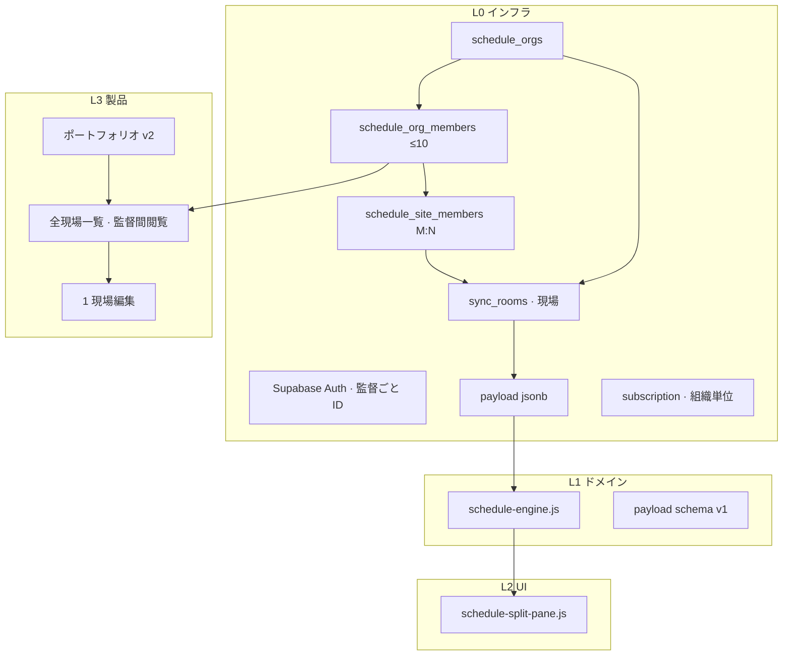
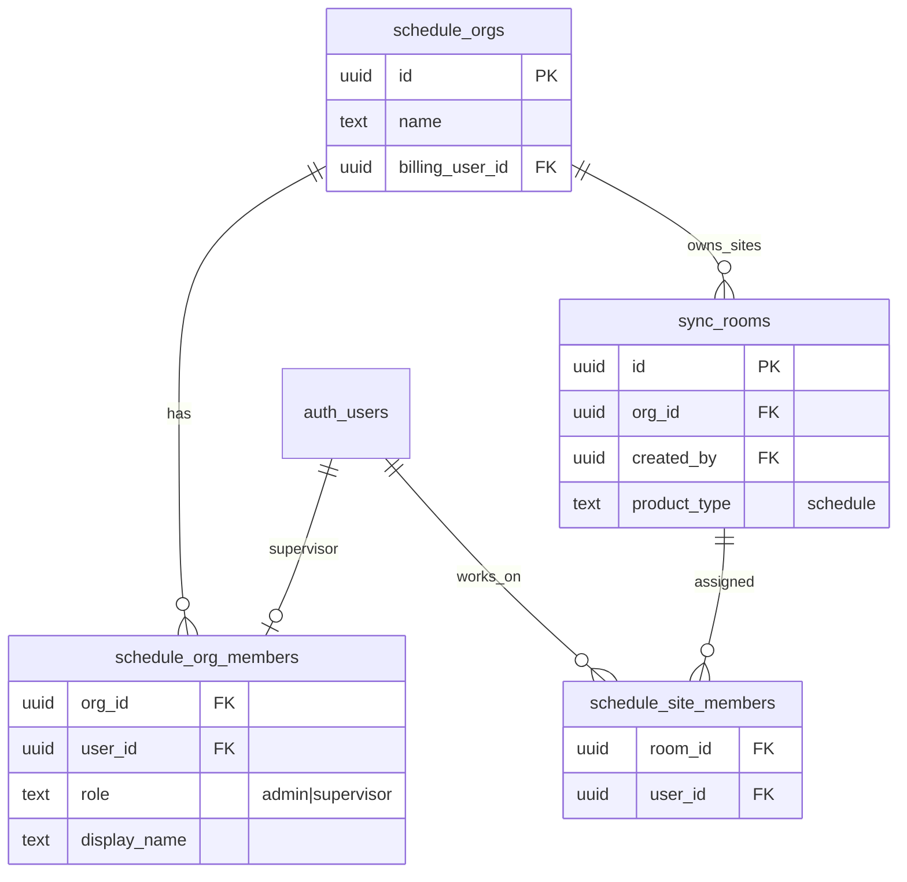
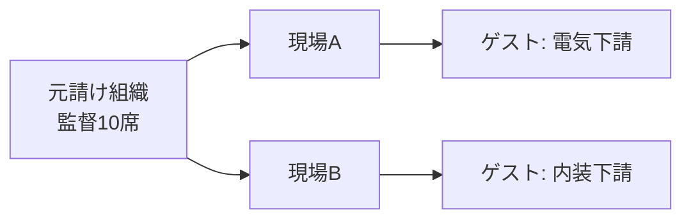
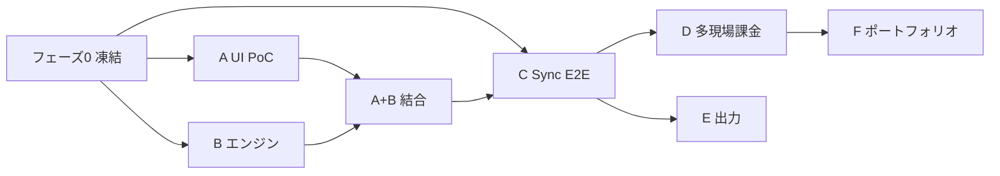

# Schedule v3 — 全体実装計画（Notion タイムライン · 現場 · ポートフォリオ）

**更新:** 2026-06-29（§3-4 組織・現場監督10名）  
**ステータス:** **計画正本** — 実装着手前に本ファイルとゲートを通す  
**上位決定:** [`SYNC_SCHEDULE_PRODUCT_DECISION.md`](SYNC_SCHEDULE_PRODUCT_DECISION.md) v3  
**参照 UX:** [TEMP: Notion WBS/ガント](https://temp.co.jp/blog/wbs)  
**詳細仕様（v3 改訂待ち）:** [`SCHEDULE_TOOL_SPEC.md`](SCHEDULE_TOOL_SPEC.md)

> **目的:** frappe PoC / v2 Excel 表路線の **手戻りを防ぐ**。  
> **動機（提督）:** [`SYNC_SCHEDULE_PRODUCT_DECISION.md`](SYNC_SCHEDULE_PRODUCT_DECISION.md) §0 — 転記削減 · 様式多様 · **監督は新ツールを勉強しない**  
> **原則:** **データモデル → エンジン → UI 殻 → Sync** の順。各フェーズ末に **提督ゲート** を置き、次へ進まない。

---

## 0. 一行定義

**Notion の「タイムライン + テーブル表示」を、会社内の現場監督が各自ログインして現場ごとに作る — Sync ラインの **旗艦**（`sync.sugudasu.com` ハブ中心 · §3-0c）· ¥200/月（監督 **10名** / 会社）。**

| やる | やらない（v1） |
|------|----------------|
| 左表 + 右棒 · 行同期 · 棒 DnD | Notion ワークスペース全体 · ページ階層 |
| サブアイテム（同階層フラット） | Excel Import |
| 依存矢印（既定=期間維持シフト） | リソース平準化 · ERP |
| 現場ごと DB · 共有 URL | リアルタイム共同編集（複数カーソル） |
| フィルタ · プロパティ追加 | ボードビュー · ポートフォリオ（v2） |
| xlsx Export · A3 印刷（後半） | 変更履歴 DB（最新1版のみ） |

---

## 1. 手戻りの教訓（なぜ計画が必要か）

| 失敗 | 原因 | 本計画での対策 |
|------|------|----------------|
| frappe-gantt PoC がイマイチ | **表がない** · 親ごと別チャート | フェーズ A = 分割ペインのみ検証 |
| v2 SSOT と v3 欲求の矛盾 | 「ガント DnD OUT」と Notion クローンが両立しない | v3 で **OUT を撤回** · 本ファイルが実装順の正本 |
| Schedule / Timeline 混同 | 同一単語「タイムライン」 | **T13=分刻み当日** · **Schedule=日ベース現場** を固定 |
| エンジンと UI の同時着手 | 棒 DnD だけ先に作ると連動が後付け | **schedule-engine.js を UI より先**（フェーズ B） |
| Sync 先行 | payload 未固定で room を作る | **payload schema v1 をフェーズ 0 で凍結** |

**凍結:** `tmp/schedule-gantt-poc/` — 参照禁止（アーカイブ）。

---

## 2. アーキテクチャ（4 層 · 依存方向は一方向のみ）



| 層 | モジュール（案） | 責務 |
|----|------------------|------|
| **L0** | `schedule_orgs` · `schedule_org_members` · `schedule_site_members` | 組織 · 監督10名 · 現場割当 |
| **L1** | `assets/schedule-engine.js` | 日付連鎖 · 依存3モード · 稼働日 · サブアイテム順序 |
| **L1** | `assets/schedule-payload-schema.js` | バリデーション · マイグレーション hook（v1 のみ） |
| **L2** | `assets/schedule-split-pane.js` | 行高同期 · スクロール結合 · ズーム（週/月） |
| **L2** | `assets/schedule-table.js` | セル編集 · インデント · フィルタ UI |
| **L2** | `assets/schedule-timeline.js` | 棒描画 · DnD · 依存矢印 SVG |
| **L3** | `assets/schedule-site-app.js` | 1 現場のオーケストレーション |
| **L3** | `assets/schedule-dashboard.js` | **組織内全現場一覧**（監督どおし閲覧）· 新規現場 |
| **L3** | `assets/schedule-portfolio.js` | **v2** · タイムライン横断俯瞰（一覧の強化版） |

**共有しない:** T13 の `timeline-app.js` UI — **エンジン思想のみ** `timeline-engine.js` から参考。

---

## 3. データモデル（フェーズ 0 で凍結）

### 3-4. 組織 · 現場監督（提督 2026-06-29 · フェーズ 0 確定事項）

**ペルソナ:** 建設会社などで **現場監督が最大10人**。各自 **メール+パスワード**（[`SYNC_AUTH_POLICY.md`](SYNC_AUTH_POLICY.md)）でログインし、担当現場の工程表（ガント）を作る。**監督同士は他の現場のガントも閲覧できる**。

| 用語 | 説明 |
|------|------|
| **組織（org）** | 契約単位（1社）· **¥200/月** · 監督 **10席** |
| **現場監督（supervisor）** | `auth.users` 1人 = ログイン ID 1つ · `schedule_org_members` に所属 |
| **現場（site）** | `sync_rooms`（`product_type=schedule`）· **組織に属する** |
| **現場割当** | `schedule_site_members` — **現場:監督 = M:N** |

**現場と監督の関係（どちらもあり得る）:**

| パターン | 例 | DB |
|----------|-----|-----|
| **1現場 · 1監督** | A工事は佐藤監督のみ | `site_members` 1行 |
| **1現場 · 複数監督** | B工事は佐藤+鈴木 | `site_members` 複数行 |
| **1監督 · 複数現場** | 佐藤が A・C 工事 | 同一 `user_id` が複数 `room_id` |

**権限（v1）:**

| 操作 | 誰ができるか |
|------|----------------|
| **組織内の全現場を閲覧** | 同じ `org_id` の **全監督**（監督どおし閲覧） |
| **現場の工程表を編集** | その現場の **`schedule_site_members` に載っている監督** のみ |
| **現場の新規作成** | 組織の監督（作成者を自動で `site_members` に追加） |
| **監督の招待** | **組織 admin**（初回作成者）· 上限 **10名** |
| **編集ロック** | **現場あたり同時1編集者**（担当監督の誰か1人が「編集開始」） |

**外部共有（職人・施主）:** ログイン不要の閲覧 URL は **編集権限とは別** — 担当監督が発行 · noindex（T13 同型）。



**課金の置き方:**

| 項目 | 方針 |
|------|------|
| 請求 | **組織1件あたり ¥200/月**（`billing_user_id` = 初回 admin） |
| 含む | 監督 **10席** · 現場 **10** / 組織 · ゲスト **20席**（§3-5 · 監督席とは別） |
| entitlements | `user_entitlements` は **billing ユーザー** に紐づけ · org 全体が active |

**ポートフォリオとの関係:** フェーズ D の「全現場一覧」= **監督ログイン後のホーム**（組織内閲覧）。フェーズ F のポートフォリオ = **タイムライン横断の俯瞰 UI**（同じデータ · 表示だけ強化）。

**RLS 方針（概要）:**

- `SELECT sync_rooms` — **組織メンバー:** 同一 `org_id` の全現場 · **ゲスト:** `schedule_site_guests` に載った現場のみ
- `UPDATE payload` — `schedule_site_members` **または** `schedule_site_guests`（`guest_editor`）に自分がいる現場
- `INSERT room` — org の監督メンバー · entitlement active

---

### 3-5. ゲスト（下請け · 提督 2026-06-29）

**背景:** **元請け** が契約主体でも、**下請け会社が自社工区のスケジュールを決める**ことがある。ゲストは **監督10席に含めない** 別 ID。

| 用語 | 説明 |
|------|------|
| **ゲスト（guest）** | 外部（下請け）の `auth.users` · `schedule_site_guests` で現場に紐づく |
| **招待** | 元請けの **admin または当該現場の担当監督** がメール招待 |
| **ゲストの見える範囲** | **招待された現場のみ**（組織の他現場・ポートフォリオは **不可**） |
| **ゲストの編集** | 招待現場の工程表を **編集可**（現場単位の排他ロックは監督と **同一ルール**） |



**DB（追記）:**

```text
schedule_site_guests
  room_id FK → sync_rooms
  user_id FK → auth.users
  invited_by FK → auth.users
  company_label text NULL   -- 表示用「〇〇工業」
  role text DEFAULT 'guest_editor'   -- v1 はこの1種のみ
  created_at timestamptz
  UNIQUE (room_id, user_id)
```

| 操作 | 監督（組織内） | ゲスト（下請け） |
|------|----------------|------------------|
| 組織内の全現場を閲覧 | ◎ | ×（招待現場のみ） |
| 現場の工程表を編集 | 割当監督のみ | 招待された現場のみ |
| ゲストを招待 | admin · 担当監督 | × |
| 監督を招待 | admin | × |
| 現場の新規作成 | 監督 | × |
| 外部閲覧 URL 発行 | 監督 | △（v1.1 検討 · 初版は監督のみ） |

**上限（v1）:**

| 項目 | cap |
|------|-----|
| 監督 / 組織 | **10** |
| 現場 / 組織 | **10** |
| ゲスト / 組織 | **20**（監督席とは別カウント） |
| ゲスト / 現場 | **5**（ソフト警告 3） |

**v1 スコープ:** ゲストは **現場全体** を編集可（工区だけの行フィルタは v1.1 — `items[].contractorTag` 等で絞る想定をメモのみ）。

**課金:** ゲスト席は **¥200/月 に含む**（追加課金なし · 上限で防衛）。

**フェーズ:** ゲスト招待 E2E は **フェーズ D**（多現場と同時）。UI 殻・エンジンには影響しない。

---

### 3-1. 用語（一覧）

| 用語 | DB / UI | 説明 |
|------|---------|------|
| **組織（org）** | `schedule_orgs` | 契約・監督プール · §3-4 |
| **現場監督** | `schedule_org_members` | ログイン ID · 最大 **10** / org · **組織内** |
| **ゲスト（下請け）** | `schedule_site_guests` | ログイン ID · 最大 **20** / org · **招待現場のみ** |
| **現場（site）** | `sync_rooms` | `org_id` 必須 · 最大 **10** / org |
| **現場割当** | `schedule_site_members` | 編集可能な監督（M:N） |
| **アイテム（item）** | `payload.items[]` | タスク行 · サブアイテムは `parentItemId` |
| **依存（dependency）** | `payload.dependencies[]` | 有向エッジ · `shiftMode` |
| **プロパティ** | `payload.properties[]` | 列定義 |
| **ポートフォリオ** | **集約ビュー**（v2） | payload のコピーではない |

**混同禁止:**

| 概念 A | 概念 B |
|--------|--------|
| 表の **親ID**（v2 直列連動） | **parentItemId**（WBS サブアイテム）— v3 では **サブアイテムのみ** · 直列は依存で表現 |
| T13 **イベント** | Schedule **現場** |
| `room`（内部） | ユーザー向け **現場** |

### 3-2. `sync_room_states.payload` v1（案）

```json
{
  "schemaVersion": 1,
  "mode": "day",
  "workingWeekdays": [1, 2, 3, 4, 5],
  "extraWorkingDates": [],
  "properties": [
    { "id": "prop_title", "label": "タスク", "kind": "title", "system": true },
    { "id": "prop_start", "label": "開始", "kind": "date", "system": true },
    { "id": "prop_end", "label": "終了", "kind": "date", "system": true },
    { "id": "prop_status", "label": "ステータス", "kind": "select", "options": ["未着手", "進行中", "完了"], "system": true },
    { "id": "prop_assignee", "label": "担当", "kind": "text", "system": true }
  ],
  "items": [
    {
      "id": "item_001",
      "parentItemId": null,
      "sortKey": "a0",
      "values": {
        "prop_title": "設計フェーズ",
        "prop_start": "2026-07-01",
        "prop_end": "2026-07-10",
        "prop_status": "進行中",
        "prop_assignee": "山田"
      },
      "barColor": null
    }
  ],
  "dependencies": [
    {
      "id": "dep_001",
      "fromItemId": "item_001",
      "toItemId": "item_002",
      "shiftMode": "maintain_gap"
    }
  ],
  "viewState": {
    "zoom": "month",
    "filters": [],
    "hiddenPropertyIds": []
  }
}
```

| フィールド | ルール |
|------------|--------|
| `sortKey` | フラット順序（サブアイテムは親直後 · Notion「同階層に並べる」） |
| `shiftMode` | `overlap_shift` \| **`maintain_gap`**（既定）\| `none` |
| `mode` | v1 は **`day` のみ** · `datetime` は v1.1（T13 と役割分担） |
| `schemaVersion` | 整数 · 破壊的変更時のみ +1 |

### 3-2.1 提督確定 — 提出物 · ビュー · 導入（2026-06-29 · Gemini 追問）

参照: [`schedule-supervisor-workflow-gemini-RESULT.md`](schedule-supervisor-workflow-gemini-RESULT.md)

| Q-ID | 回答 | 製品への指示 |
|------|------|----------------|
| **Q-SUB-01** | **紙 / PDF が正本**（電子納品は増加傾向だが v1 の提出正はここ） | Export **第一級 = A3 印刷 + PDF** · xlsx は二次（転記・社内編集）· 電子納品 XML は **v2 以降** |
| **Q-SUB-03** | **v1 は進捗％を出さない**（月間工程は日程のみ） | `properties` に進捗％列なし · 出来高連動は v1.1 |
| **Q-VW-01** | **A — 同じ並び・表示だけ切替** | `sortKey` は preset 間で共有 · 行/列のマスクのみ |
| **Q-VW-02** | **B — はみ出し時は警告** | ops が親 `submit` 期間外 → UI 警告 · **親棒は自動伸長しない** |
| **Q-BAR-01** | **A — 月末提出の Export 短縮** | LP/オンボーディングの第一訴求 = **監理者提出が数分** · 現場トラブル回避は副次 |

**1DB + ビュー（凍結）:**

| 概念 | フィールド |
|------|------------|
| 行の出し分け | `items[].visibility`: `submit` \| `site` \| `both` |
| 列の出し分け | `properties[].tier`: `official` \| `ops` |
| 画面 preset | `viewState.presets.submit` / `.site` |
| **提出 Export / 印刷** | **常に `preset=submit` 固定**（ops 行・ops 列を除外） |

```json
"viewState": {
  "activePreset": "site",
  "zoom": "month",
  "presets": {
    "submit": {
      "hiddenPropertyIds": [],
      "hideVisibility": ["site"],
      "hidePropertyTiers": ["ops"]
    },
    "site": {
      "hiddenPropertyIds": [],
      "hideVisibility": [],
      "hidePropertyTiers": []
    }
  },
  "filters": []
}
```

| `items[]` 追加 | `visibility` 省略時は `both` |
|----------------|------------------------------|

### 3-3. 上限（[`SYNC_STORAGE_QUOTAS.md`](SYNC_STORAGE_QUOTAS.md) と整合）

| 項目 | v1 案 | 超過 |
|------|-------|------|
| **監督 / 組織** | **10** | 招待不可 |
| **現場 / 組織** | **10** | 新規現場ブロック |
| **ゲスト / 組織** | **20** | 招待不可 |
| **ゲスト / 現場** | **5**（ソフト 3） | 警告 |
| アイテム / 現場 | **500**（ソフト 200） | LIMIT-SSOT |
| プロパティ / 現場 | **30**（ソフト 15） | 警告 |
| 依存 / 現場 | **300** | 警告 |
| payload サイズ | Sync 既存 cap 準拠 | 保存拒否 |

---

## 4. 連動エンジン（`schedule-engine.js`）— フェーズ B 仕様骨子

**入力:** `payload` + **操作**（`op`）  
**出力:** 新 `payload`（イミュータブル）

| op 種別 | 例 | エンジン |
|---------|-----|----------|
| `edit_cell` | 終了日を直接変更 | 所要逆算 · 依存伝播 |
| `move_bar` | 棒 DnD（日数シフト） | `maintain_gap` 下流 |
| `add_dependency` | 矢印作成 | 循環検出 · 拒否 |
| `insert_item` | 行追加 | `sortKey` 採番 |
| `reorder` | 行 DnD | 順序のみ（日付は不変） |

**Notion 依存3モード（必須）:**

| モード | 挙動 |
|--------|------|
| `overlap_shift` | 重なったときだけ後続をずらす |
| **`maintain_gap`**（既定） | 先行の終了変更 → 後続が **ギャップ維持** で追随 |
| `none` | 依存は可視化のみ · 日付は自動変更しない |

**v1 で継承しない（v2 Excel 表の親ID/CP）:** `parentId` 直列 · `criticalPath` フラグ — **依存グラフに一本化**。

**稼働日:** v2 SSOT どおり · 日数カウントは稼働日のみ。

**テスト:** `scripts/schedule-engine.test.mjs` — エンジン完成が **フェーズ B ゲート**。

---

## 5. UI 設計（分割ペイン · 自前）

### 5-1. Notion 再現の最小セット（フェーズ A ゲート）

```
┌─────────────────────────────────────────────────────────────┐
│ [週|月]  今日へ                    フィルタ…                │
├──────────────────┬──────────────────────────────────────────┤
│ 表（固定幅）      │ タイムラインヘッダ（日付目盛）              │
│ タスク|開始|終了  │                                          │
│ ─────────────────│──────────────────────────────────────────│
│ 設計フェーズ      │ ████████████                             │
│  └ ワイヤー       │   ████                                   │
│  └ UI            │      ██████                              │
│ （縦スクロール連動）│ （同じ行高 · 同期スクロール）              │
└──────────────────┴──────────────────────────────────────────┘
```

| 要件 | 実装メモ |
|------|----------|
| 行高一致 | 1 つの `rowMetrics[]` を表と棒で共有 |
| 縦スクロール | `scrollTop` を双方向バインド（ループ防止フラグ） |
| 横スクロール | **タイムライン側のみ**（表は固定列） |
| 棒 DnD | `pointerdown` → 日付換算 → `move_bar` op |
| 依存矢印 | SVG overlay · `from`/`to` 棒の端点座標 |
| サブアイテム | 表でインデント · 棒は同列（親と同じ swimlane 行） |

**技術選定（固定）:**

| 選択 | 理由 |
|------|------|
| **frappe-gantt 不使用** | 表同期不可 |
| **DHTMLX 不使用** | PM UI が強すぎ · 分割ペイン再実装コスト |
| **Canvas 不使用（v1）** | a11y · DOM と表の対応が難しい |
| **SVG + HTML 表** | Notion に近い · 印刷/CSS 継承 |

### 5-2. デザイン SSOT

実装前に必読: [`DESIGN_NOTION_SUGUDASU_ADAPT.md`](DESIGN_NOTION_SUGUDASU_ADAPT.md) · [`DESIGN_GUIDELINE_SYNC.md`](../DESIGN_GUIDELINE_SYNC.md)

---

## 6. URL · Sync 統合

[`SYNC_URL_INFORMATION_ARCHITECTURE.md`](SYNC_URL_INFORMATION_ARCHITECTURE.md) 準拠:

| 種別 | URL |
|------|-----|
| LP | `https://sync.sugudasu.com/schedule` |
| App（一覧） | `https://sync.sugudasu.com/schedule/app` — **ログイン後 · 組織内全現場** |
| App（現場） | `https://sync.sugudasu.com/schedule/app?s={room_id}` または `/schedule/app/site/{id}` |
| 閲覧共有 | `https://sync.sugudasu.com/s/{public_id}` — **`ss_` 名前空間（新規 · 要 `SYNC_EVENT_ID` 追記）** |
| ポートフォリオ v2 | `https://sync.sugudasu.com/schedule/portfolio` |

| DB | 値 |
|----|-----|
| `sync_rooms.product_type` | `schedule` |
| `sync_rooms.title` | 現場名 |
| 課金 | **組織単位** subscription · admin の `user_entitlements` |

**排他編集（v1）:** **現場ごと** 同時1編集者 — 「編集開始/保存/編集終了」（**B案 · 提督確定**）。ロック取得可: **担当監督** または **当該現場のゲスト**。他者は閲覧のみ。

**リアルタイム:** v1 は **保存時マージ**（revision）のみ · WebSocket は v2 検討。

---

## 7. フェーズ分割 · ゲート · 成果物

### フェーズ 0 — 設計凍結（**提督 Q1–Q4 + ゲスト 確定 · 0-2〜0-4 残**）

| # | 成果物 | ゲート |
|---|--------|--------|
| 0-1 | 本ファイル · §3-4–3-5 | **✅ 提督確定（2026-06-29）** |
| 0-2 | `SCHEDULE_TOOL_SPEC.md` v3 改訂 | 着手可 |
| 0-3 | DDL 案（org · members · site_members · **site_guests**） | 0-2 と並行 |
| 0-4 | payload v1 typedef | 0-2 と並行 |

**提督判断（確定）:**

| # | 質問 | 決定 |
|---|------|------|
| Q1 | 現場数 cap / 組織 | **10** |
| Q1a | 監督人数 / 組織 | **10**（各自ログイン ID） |
| Q1b | 監督どおし | 組織内の **全現場を閲覧** · 編集は割当現場のみ |
| Q1c | 1現場の監督 | **M:N**（1人/複数人どちらも可） |
| Q2 | 排他 B案 | **はい**（編集開始/保存/編集終了 · 現場ごと1編集者） |
| Q3 | 外部閲覧 URL | **はい**（ログイン不要 · noindex） |
| Q4 | datetime v1 | **いいえ**（v1.1 · まず日ベース） |
| Q5 | 非担当監督の他現場 | **閲覧のみ** |
| Q6 | ゲスト（下請け） | **要** — 招待制 · 招待現場のみ表示/編集 · **監督10席に含めない** |
| Q6a | ゲスト cap | **20 / 組織** · **5 / 現場**（¥200 に含む） |

---

### フェーズ A — UI 殻 PoC（**Sync なし · 1 週間**）

| # | 内容 |
|---|------|
| A-1 | `tmp/schedule-split-pane-poc/` — 静的 HTML + モジュール · `npm run poc:schedule-split-pane` · 仕様 [`SCHEDULE_SPLIT_PANE_POC_SPEC.md`](SCHEDULE_SPLIT_PANE_POC_SPEC.md) · **議論ログ** [`SCHEDULE_SPLIT_PANE_DECISION_LOG.md`](SCHEDULE_SPLIT_PANE_DECISION_LOG.md) |
| A-2 | ダミー 20 行 · サブアイテム 5 · スクロール同期 |
| A-3 | 棒 DnD → 表の日付更新（エンジンはスタブ） |
| A-4 | 週/月ズーム切替 |

**ゲート A:** 提督が「Notion に近い」と言える · **通過するまで Sync/エンジン本実装に入らない**

---

### フェーズ B — エンジン（**DOM なし · 1 週間**）

| # | 内容 |
|---|------|
| B-1 | `schedule-engine.js` + `schedule-engine.test.mjs` |
| B-2 | 依存3モード · 循環検出 · 稼働日 |
| B-3 | PoC UI に接続 · 表編集と棒 DnD が同じ op 経由 |

**ゲート B:** `npm run test:schedule`（新規 script）全緑 · 手動 10 シナリオ（終了直接編集・依存チェーン）

---

### フェーズ C — 1 組織 · 2 監督 · 1 現場 E2E（**2 週間**）

| # | 内容 |
|---|------|
| C-0 | 組織作成 · 監督2名招待（メール+パスワード） |
| C-1 | `schedule-site-app.js` · 現場 CRUD · `site_members` |
| C-2 | 保存 / revision · **現場単位**排他ロック |
| C-3 | 監督Aが作成 · 監督Bが **閲覧**（編集は割当次第） |
| C-4 | 外部閲覧 URL（read-only） |
| C-5 | dogfood 1 現場 |

**ゲート C:** 1 現場を提督が 1 週間実務投入 · クラウド保存・共有が破綻しない

---

### フェーズ D — 10監督 · 多現場 + 課金（**1〜2 週間**）

| # | 内容 |
|---|------|
| D-1 | ダッシュボード — **組織内全現場**（監督どおし一覧） |
| D-2 | 監督招待 · **10席 cap** |
| D-3 | 現場割当 UI · **ゲスト招待**（下請けメール） |
| D-4 | ゲスト cap（20/組織 · 5/現場） |
| D-5 | Stripe · 組織 subscription |
| D-6 | LP `schedule` |

**ゲート D:** LP + Checkout + 2 現場作成が E2E

---

### フェーズ E — 出力（**1 週間 · C と並行可** · §3-2.1 提督確定）

| # | 内容 |
|---|------|
| E-1 | **A3 横印刷 + PDF Export**（`preset=submit` 固定 · 正本は紙/PDF） |
| E-2 | xlsx Export（二次 · 転記・社内編集 · セル書式は最小） |
| E-3 | （v2）電子納品連携 · 進捗％・出来高プロパティ |

---

### フェーズ F — ポートフォリオ（**v2 · 2 週間**）

| # | 内容 |
|---|------|
| F-1 | 全現場の items を **読み取り集約**（N+1 回避 · 一覧 API or バッチ） |
| F-2 | 泳道 = 現場名 · 色 = 現場ごと |
| F-3 | クリック → 該当現場 App へ |

**ゲート F:** 3 現場以上で俯瞰が実用になること

---

### フェーズ G — 拡張（v1.1+）

| 項目 | 時期 |
|------|------|
| 四半期/年ズーム | v1.1 |
| `datetime` モード | v1.1 |
| ボードビュー | v2 |
| 変更履歴 | v2 以降 · 要ストレージ政策 |
| リアルタイム Presence | v2 以降 |

---

## 8. 依存関係図（何を先にやるか）



**並行禁止（手戻り源）:**

- Sync room 実装 **前に** payload 凍結（フェーズ 0）
- 本番 `assets/schedule-*.js` **前に** フェーズ A ゲート
- LP/Stripe **前に** 1 現場 dogfood（ゲート C）
- ポートフォリオ **前に** 多現場一覧（フェーズ D）

---

## 9. リスクと緩和

| リスク | 影響 | 緩和 |
|--------|------|------|
| 分割ペインのスクロールバグ | 全 UX 破綻 | フェーズ A のみで潰す |
| 依存の循環・爆発伝播 | データ破損 | エンジン単体テスト · 最大伝播深度 cap |
| payload 肥大 | Supabase コスト | 上限 · ソフト警告 |
| T13 とのコード共有過多 | 両方壊れる | UI は分離 · 日付/分の変換層のみ共有検討 |
| v2 SSOT の残存 | Agent 混乱 | `SCHEDULE_TOOL_SPEC` v3 一括改訂（フェーズ 0-2） |
| スマホ | 編集不可（v1） | 閲覧は横スクロール許容 · 編集は desktop のみ明示 |

---

## 10. 検証 · 完了定義

### v1 リリース（フェーズ D + E 完了）

- [ ] Notion 記事の STEP 1〜7 相当（ボード除く）が 1 現場でできる
- [ ] 監督10席 · 現場10 · ゲスト20 · 組織課金
- [ ] 監督どおし全現場閲覧 · ゲストは招待現場のみ
- [ ] ¥200/月 課金 · LP 掲載
- [ ] xlsx Export · A3 印刷
- [ ] `npm run test:schedule` · `npm run validate:tool-naming` · sync deploy ゲート

### v2（ポートフォリオ）

- [ ] 全現場を 1 画面で俯瞰 · 現場へドリルダウン

---

## 11. ドキュメント MAP（Agent 着手順）

| 順 | ファイル |
|----|----------|
| 1 | **本ファイル** |
| 2 | [`SYNC_SCHEDULE_PRODUCT_DECISION.md`](SYNC_SCHEDULE_PRODUCT_DECISION.md) |
| 3 | [`SCHEDULE_TOOL_SPEC.md`](SCHEDULE_TOOL_SPEC.md)（v3 改訂後） |
| 4 | [`DESIGN_NOTION_SUGUDASU_ADAPT.md`](DESIGN_NOTION_SUGUDASU_ADAPT.md) |
| 5 | [`SYNC_DB_ARCHITECTURE.md`](SYNC_DB_ARCHITECTURE.md) |
| 6 | [`SYNC_URL_INFORMATION_ARCHITECTURE.md`](SYNC_URL_INFORMATION_ARCHITECTURE.md) |

---

## 12. 変更履歴

| 日付 | 内容 |
|------|------|
| 2026-06-29 | §3-4 組織 · 現場監督10名 · M:N 割当 · 監督間閲覧 |
| 2026-06-29 | **フェーズ0確定** Q1–Q4 · 現場cap10 · §3-5 ゲスト（下請け20席） |
