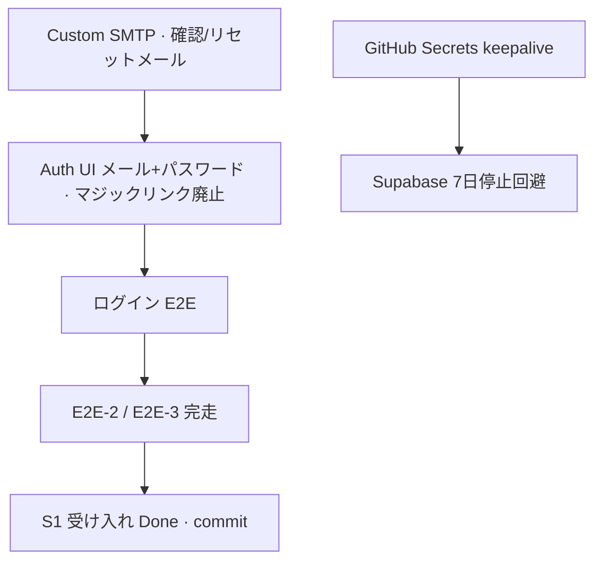

# Sync S1 — 残タスク（背景 · 思想 · 完了条件）

**更新:** 2026-06-26（Auth 方針 — メール+パスワード確定）  
**Auth 正本:** [`SYNC_AUTH_POLICY.md`](SYNC_AUTH_POLICY.md)  
**状況:** Auth は **方針転換** — マジックリンク試作は廃止方向 · UI 未実装 · E2E 一時停止

---

## 0. 全体の思想 — なぜこれらが S1 の残りか

### Sync ラインの約束（抜粋）

[`SUGUDASU_SYNC_LINE.md`](SUGUDASU_SYNC_LINE.md) より:

| 原則 | S1 で意味すること |
|------|-------------------|
| **コアは登録不要 · Sync はアカウント必須** | 幹事が一度ログインし、**数日〜数週間後**も同じルームに戻れること |
| **クラウドは短期バッファ**（`retain_until`） | 無期限保存しない · 期限を **見える化** する |
| **コスト防衛**（ルーム数 · payload 上限） | trial は **1 アクティブルーム** — 放置データを溜めない |
| **F1 違反にしない** | コア `sugudasu.com` に Sync の Cookie を載せない（ドメイン分離） |
| **有料ラインの信頼** | 「ログインできない」「なりすまされた」は **製品事故** |
| **Auth = メール + パスワード** | マジックリンク単独は **フィッシング成立** — [`SYNC_AUTH_POLICY.md`](SYNC_AUTH_POLICY.md) |

### 2026-06-26 に分かったこと

E2E で踏んだ問題は **テストの偶然ではない**:

1. **組み込み SMTP 2通/時間** → マジックリンク再送不能（**方針転換でログイン主経路から外す**）
2. **マイグレーション未適用** → `retain_until` が UI で `—`（**#2–4 適用済**）
3. **削除 UI の `disabled`** → デプロイ修正済み · E2E 未確認
4. **Auth 試作がマジックリンクのみ** → **提督確定でメール+パスワードへ**（フィッシング）

**思想:** S1 は「デモが動く」ではなく **幹事1人が本番 URL で信頼して使える** まで。Auth · 保持期限 · 削除 · 再開は **同一の信頼契約**。

### 依存関係（推奨順）

keepalive は Auth と独立だが、**本番放置時のインフラ停止**を防ぐ運用基盤。

---

## 1b. Auth — メール + パスワードへ移行（P0 · 提督確定）

| 項目 | 内容 |
|------|------|
| **状態** | [x] UI 実装済（2026-06-26）· [ ] Supabase Dashboard 設定 · E2E 未確認 |
| **正本** | [`SYNC_AUTH_POLICY.md`](SYNC_AUTH_POLICY.md) |

### なぜ変えるか（背景）

**メールアドレスだけ**（マジックリンク）では、攻撃者が偽メールを送るだけで **「届いたリンクを踏めばログイン」** させられる。幹事は忙しく、From や URL の確認が甘くなりやすい。

**メール + パスワード** なら、偽リンクだけでは足りない。ログインは **常に `sync.sugudasu.com` のフォーム** で、本人だけが知る秘密が必要。

### 思想

- 便利さ（パスワードレス）より **なりすまし耐性** — 有料 Sync の信頼契約
- 利用規約の「アカウント管理義務」と一致
- メールは **初回確認 · パスワード忘れ** に限定 → SMTP 負荷も下がる

### 完了条件

- [x] クライアント: 登録 · ログイン · パスワードリセット · リカバリ UI（2026-06-26）
- [ ] Supabase: Email+Password ON · マジックリンクログイン OFF（Dashboard · 提督）
- [ ] E2E-1 をパスワードログインで提督確認

---

## 1c. アカウント管理 — 設定 · 退会（P0–P1）

| 項目 | 内容 |
|------|------|
| **状態** | [ ] 未実装 |
| **正本** | [`SYNC_AUTH_POLICY.md`](SYNC_AUTH_POLICY.md) §5 |

### なぜ残すか

プライバシーポリシーは **退会までアカウント情報を保持** と明記。メール変更・パスワード変更は **利用規約の管理義務** の実体。ルーム削除だけでは **退会にならない**。

### 思想

| 機能 | 思想 |
|------|------|
| **アカウント削除** | 個人データの消去請求権 · 試用後のクリーンアップ · `auth.users` ごと消す |
| **メール変更** | 幹事の転勤・担当交代 · ログイン ID の更新は確認メール必須 |
| **パスワード変更** | 定期変更・漏洩疑い — リセットメールに頼らない日常操作 |

### 実装メモ

- **ID** — すべてのサーバ処理は **`auth.users.id`（JWT `sub`）** をキーにする（メールは可変）
- **削除** — `POST /api/account/delete`（Pages Function）· パスワード再確認 · `admin.deleteUser` · **S3: 先行して Stripe 解約**
- **登録** — `signUp` 成功後 `sync_profiles` を upsert（課金 API の土台）
- **メール変更** — `updateUser({ email })` · **S3: Stripe Customer email 同期**
- **パスワード変更** — `updateUser({ password })` · ログイン中のみ

### 完了条件

- [ ] アカウント設定 UI（メール表示 · 変更 · パスワード変更 · 削除）
- [ ] 削除時に全ルーム + 認証ユーザーが消える（E2E）
- [ ] 登録時に `sync_profiles` 行ができる（`id` = `auth.users.id`）
- [ ] 削除 API が **JWT の `user_id`** 基準（メール検索しない）· Stripe フック用コメントあり
- [ ] 削除前の警告文案 · 可能ならエクスポート促し

---

## 1. Custom SMTP（P0 · メールは補助経路）

| 項目 | 内容 |
|------|------|
| **状態** | [ ] 未着手（提督 · Dashboard） |
| **手順** | [`SYNC_CUSTOM_SMTP_SETUP.md`](SYNC_CUSTOM_SMTP_SETUP.md) |

### なぜ残すか（背景）

初回メール確認 · パスワードリセットに必要。組み込み SMTP は **約2通/時間** — リセット連打でも詰まる。

### 思想

- ログイン主経路は **パスワード** — SMTP は補助だが **品質は本番同等**（From · 日本語 · 到達率）
- From が `noreply@mail.app.supabase.io` のままでは **リセットメールすらフィッシングに見える**

### 完了条件

- [ ] Resend（等）で `sync.sugudasu.com` 検証済み
- [ ] Supabase Custom SMTP 送信成功
- [ ] Confirm / Reset メールが日本語 · `SUGUDASU Sync` From
- [ ] `email_sent` レートを実用値に

---

## 2. Auth メール — テンプレ日本語化（P0）

| 項目 | 内容 |
|------|------|
| **状態** | [ ] 未着手 |
| **実施** | Supabase Dashboard → Email Templates — **Confirm signup** · **Reset password**（マジックリンク用テンプレは不要化） |

### なぜ残すか

確認 · リセットメールが英語のままでは幹事が **信頼して操作できない** · フィッシングメールと区別しづらい。

### 思想

- **正規メールは日本語で統一** — 偽メールとの差別化の一助
- 件名に `SUGUDASU Sync` を必ず含める

### 完了条件

- [ ] Confirm · Reset テンプレが日本語
- [ ] From は Custom SMTP 後 `SUGUDASU Sync <noreply@sync.sugudasu.com>`

---

## 3. Auth — セッション · OTP 有効期限（P1）

| 項目 | 内容 |
|------|------|
| **状態** | [ ] Dashboard 設定 · [ ] クライアント未デプロイ（`getValidatedSession` · レート制限日本語） |
| **コード** | `assets/sync-auth.js` · `assets/sync-timeline-s1-app.js`（ローカル済み） |

### なぜ残すか（背景）

- **アクセス JWT** は1時間だが refresh で **実質無期限** が Supabase デフォルト
- 幹事が感じた「短い」は **セッション切れ後に再送できなかった** ことの増幅
- **メール内リンク** はデフォルト **1時間で失効** — 「昨日送ったリンク」は無効

### 思想

- 幹事は **1週間前に下書き → 当日にパスワードで戻る** — refresh token が効けば再入力不要
- **メールリンクはサインアップ確認・リセット専用** — 毎回ログインに使わない

### 完了条件

- [ ] Dashboard: リセットリンク有効期限の確認（不要なら OTP 24h 設定は **マジックリンク廃止に伴い縮小**）
- [ ] inactivity / time-box が accidental に有効でないことを確認
- [ ] `getValidatedSession` · レート制限エラー日本語を **deploy:pages:sync** 反映

---

## 4. 製品 E2E 完走（Auth 復帰後）

| 項目 | 内容 |
|------|------|
| **状態** | [ ] ブロック中 |
| **正本** | [`SYNC_S1_E2E_CHECKLIST.md`](SYNC_S1_E2E_CHECKLIST.md) · 試行ログ [`SYNC_S1_E2E_SESSION_LOG_20260626.md`](SYNC_S1_E2E_SESSION_LOG_20260626.md) |

### 残り項目と思想

| # | タスク | なぜ重要か |
|---|--------|-----------|
| E2E-3 | ルーム削除 | **削除は一等市民**（[`SYNC_RETENTION_POLICY.md`](SYNC_RETENTION_POLICY.md)）· 幹事が試行錯誤したルームを消せないと trial 1件制限に抵触 |
| E2E-2 | 別タブ · リロードで復元 | **クラウド下書きの約束** — コアの localStorage 手渡しを置き換える最小価値 |
| Cookie | `sugudasu.com` に `sg-sync-auth` 無し | **F1 / ドメイン分離** — コア利用者に Sync Cookie を載せない |
| `retain_until` UI | ログイン後表示確認 | DB 修正済み · **透明性**（「いつ消えるか」を幹事に見せる） |
| §5-2 | `SYNC_S1_ARCHITECTURE.md` `[x]` | インフラ Done と **製品受け入れ Done** の混同を防ぐ |

### 完了条件

- [ ] チェックリスト E2E-1〜3 すべて提督確認
- [ ] §5-2 · `BACKLOG` §5-4 の S1 受け入れを `[x]`

### E2E 時の注意（quota）

マイグレーション #3 適用後 **trial = アクティブルーム1件**。本番に2件残っている場合、**削除 E2E と同時に1件消す**（新規作成テストの前提）。

---

## 5. GitHub Secrets — Supabase keepalive（運用）

| 項目 | 内容 |
|------|------|
| **状態** | [ ] 未設定 |
| **正本** | [`SUPABASE_SYNC_KEEPALIVE.md`](SUPABASE_SYNC_KEEPALIVE.md) |

### なぜ残すか

Supabase Free は **7日間 API 無活動で Paused**（削除ではないが **ログイン不能**）。`/api/health` は CF のみで Supabase タイマーはリセットされない。

### 思想

- Sync は **イベント前はアクセスが薄い** — インフラが「使われないから止まる」は製品と矛盾
- **$0 で週2回 ping** — 有料化前の運用コスト防衛（[`SYNC_ENV_KEYS.md`](SYNC_ENV_KEYS.md)）

### 完了条件

- [ ] GitHub Secrets: `SYNC_SUPABASE_URL` · `SYNC_SUPABASE_ANON_KEY`
- [ ] Actions 週次実行ログで成功

---

## 6. 未コミット差分 · デプロイ（整理）

| 項目 | 内容 |
|------|------|
| **状態** | [ ] 提督判断で commit · 一部デプロイ済み（`364318ba`） |
| **整理** | [`UNCOMMITTED_SYNC_S1_20260626.md`](UNCOMMITTED_SYNC_S1_20260626.md) |

### なぜ残すか

- 削除 UI · JWT ビルドガード · `getValidatedSession` · エラー文言が **リポジトリに未固定**
- 再現性 · ロールバック · 別 Agent 引き継ぎのため **いつか commit 必須**

### 思想

- **本番だけ進んで Git が遅れる** と、同じ轍を踏む（[`SYNC_S1_E2E_SESSION_LOG_20260626.md`](SYNC_S1_E2E_SESSION_LOG_20260626.md) §6 教訓）
- commit は提督タイミング — Agent は **DEPLOY_LOG 台帳** と SSOT を先に正す

### 完了条件

- [ ] 提督指示で `feat(sync): …` / `docs(sync): …` コミット
- [ ] 未デプロイのクライアント差分があれば `deploy:pages:sync` + `DEPLOY_LOG` 更新

---

## 7. 意図的に S1 外に置くもの

| 項目 | 理由 |
|------|------|
| S2 フルエディタ · Push/Pull | S1 は **保存・再開まで**（[`SYNC_S1_ARCHITECTURE.md`](SYNC_S1_ARCHITECTURE.md)） |
| `sync.sugudasu.com/statements` | リーガル整備は並行可だが E2E ブロッカーではない |
| S1.5 `event_public_id` | 共有 URL 固定は **S1 受け入れ後**（[`SYNC_IMPLEMENTATION_TASKS.md`](SYNC_IMPLEMENTATION_TASKS.md)） |

---

## 8. 変更履歴

| 日付 | 内容 |
|------|------|
| 2026-06-26 | §1c — 課金 API 連携前提（`auth.users.id` 正本 · Functions · Stripe フック） |
| 2026-06-26 | Auth 方針 — メール+パスワード確定 · §1b · [`SYNC_AUTH_POLICY.md`](SYNC_AUTH_POLICY.md) |
| 2026-06-26 | 初版 — Auth ブロック · DB #2–4 適用 |
